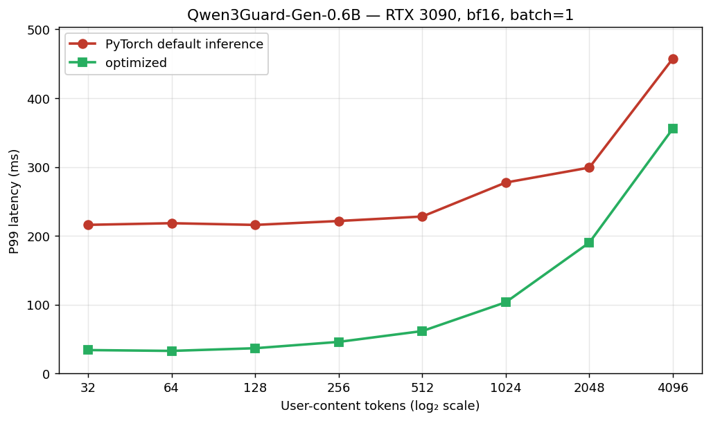
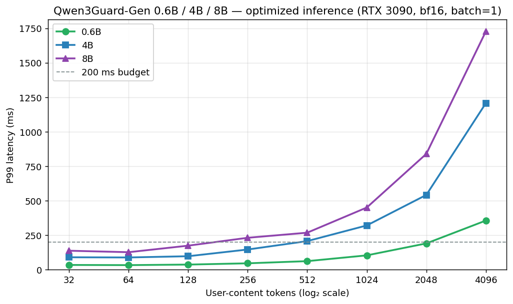

# Qwen3Guard Generative Classifier Performance Report

[[_TOC_]]

# Introduction

Qwen3Guard-Gen is a language model fine-tuned as a 3-way content-safety classifier (Safe / Controversial / Unsafe).

In this report we test this new approach (LLM-as-classifier) as compared to the training lightweighted model approach.

Originally a naive PyTorch default inference would runs above a 200 ms P99 target (roughly 325 ms P99). Later we found that the naive way will needs run about 9 autoregressive decode steps per call.
We will then use teacher-forcing and then use the token prob as classification (which get rid of the decoding part, and only needs the pre-fill part of the LLM), this would make us at 31 ms P50 (36ms P99) for the 0.6B model for 128 token content classification.
For 100ms budget P99, we can handle 1024 input length.
For 200ms budget P99, we can handle 2048 input length. (On a Nvidia 3090)

## 1. Background

Our gateway sits between end users and a hosted LLM. Every assistant response passes through an Output Security Engine that must scan the text and allow / redact / block it within reasonable time.
One of its features — *Semantic Content Moderation* — flags politically sensitive, violent, sexual, self-harm, and discriminatory content in free-form natural language.

Semantic moderation cannot be captured by rules. A semantic model is required.

A practical pattern recently is the idea of **LLM-as-classifier**: fine-tune a general-purpose causal language model so that, given a chat-formatted input, it emits a *structured* classification. In this way we can use a pretrained model that understand many languages, many harm categories, and a severity scale. Published methods of the family include Meta's Llama Guard, Google's ShieldGemma, and Alibaba's Qwen3Guard.

In this document we use **Qwen3Guard-Gen-0.6B**. It is the smallest member of Alibaba's 2025 Qwen3Guard family (0.6 B / 4 B / 8 B), Apache 2.0-licensed, multilingual, and ships both a prompt-moderation and a response-moderation mode. This report shows how we bring its per-call latency under budget.

## 2. Qwen3Guard-Gen method

### 2.1 The prompt template

The classifier has two modes. **Prompt moderation** takes a user query only. **Response moderation** takes a full [user, assistant] dialogue and additionally emits a `Refusal: Yes/No` line. Both use a Qwen3 chat template plus a system prompt that names nine harm categories (Violent, Non-violent Illegal Acts, Sexual Content or Sexual Acts, PII, Suicide & Self-Harm, Unethical Acts, Politically Sensitive Topics, Copyright Violation, Jailbreak) and fixes the output schema:

> ```
> Safety: Safe | Unsafe | Controversial
> Categories: <comma list, or None>
> Refusal: Yes | No        # response-moderation mode only
> ```

Only the verdict word after `Safety: ` carries the severity signal; everything else is boilerplate the model has been fine-tuned to emit deterministically. Here we only discuss the Safety classification part. We want to get the classification part as quickly as possibly, when only hit (unsafe) instances would be allowed optionally to generate anything later (category, other info).

### 2.2 Modifiable Template enables policy change without re-training

The safety policy (which content is safe or unsafe) is inside the system prompt, not in the model weights. Adding or modifying it to cover some particular category of content requires only a prompt edit, not retraining or fine-tuning.
For example, say we have a **`SENSITIVE_TOPIC`** category, we can be introduced by appending one line to the system prompt's category list:

> ```
> SENSITIVE_TOPIC: Content that discusses {your policy text},
> including references to {keyword list}.
> ```

This makes it a easy way to let administrators to modify the prompt to enable it with new capabilities without re-training or fine-tuning.

Alibaba ship their "strict" vs "loose" evaluation modes — identical weights, different system wording. This prompt-level editability is the structural difference from fine-tuned binary classifiers (e.g. DeBERTa-for-prompt-injection), which require a new fine-tune to change the label space.

### 2.3 Training Effort

Qwen3Guard-Gen is built on the instruction-tuned Qwen3 base models and produced by supervised fine-tuning on **~1.19 M labeled samples** (human-annotated plus synthetic), extended to 119 languages via machine translation, with a distillation pass and a GSPO reinforcement-learning pass layered on top. Labels come from an ensemble of large Qwen models with majority voting (F1 > 0.9 against a human-annotated validation set). **Training compute is not published.** A rough estimate (not a measurement) places it in the low thousands of A100-GPU-hours across the three size variants.

## 3. Latency and optimization

The default inference is by **PyTorch default inference**.
It is the pattern from the model card: render the chat template, call `model.generate(max_new_tokens=16, do_sample=False)`, parse the generated text.

We here introduced a **optimized** path of teacher-forcing. By doing this we can get rid of the decoding steps for the classification.

This is possible as we know the `"Safety: "` prefix will be outputted anyway, so we force model to always generate it (treat it essentially as input) and then reads the model's next-token distribution at the last position.

Then an argmax over the three verdict token ids (`safe`, `unsafe`, `controversial`) gives the classification result. 
(ShieldGemma's model card publishes the identical recipe verbatim; Llama Guard 3's publishes the first-token-logit variant).

**Why this works** At representative input (say 369 tokens, in the 0.6 B model on RTX 3090), the stage-by-stage cost of the two paths:

PyTorch default inference:
```
  input
   → render chat template
   → prefill                         ~21 ms
   → decode × 9 steps                ~17 ms / step × 9 ≈ 153 ms
   → regex parse                     microseconds
   → verdict (+ categories)
  TOTAL ≈ 237 ms P50 / 325 ms P99
```

Optimized:
```
  input
   → render chat template + "Safety: "
   → prefill                         ~21 ms
   → read 3 logits at last position  <1 ms
   → verdict
  TOTAL ≈ 29 ms P50 / 33 ms P99
```

The decode loop is eliminated.

### 3.1 0.6B latency across input lengths



**Figure 1.** P99 latency for Qwen3Guard-Gen-0.6B, 100 timed iterations per input length. The default path sits at 216–458 ms P99 — flat at short inputs (decode-bound), rising only once prefill becomes non-trivial past 1024 tokens. The optimized path sits at 33–356 ms P99 and meets the 200 ms budget at every length ≤ 2048 user tokens; at 4096 tokens the prefill alone is 184 ms and no decode-side optimization can help further.

At representative input, decode accounts for ~88 % of the default path's wall-clock; the optimization removes that share.
### 3.2 Cross-size comparison — 0.6B / 4B / 8B



**Figure 2.** Optimized-path P99 latency for Qwen3Guard-Gen-0.6B / 4B / 8B. All three variants benefit from the same teacher-forced-prefix optimization, but the 200 ms P99 budget binds tightly with parameter count: **0.6B clears the budget up to 2048 user tokens, 4B up to 256 (borderline at 512), and 8B up to 128**. At 4096 tokens, only 0.6B stays under half a second.

**Qwen3Guard-Gen-0.6B with the optimized path meets the 200 ms P99 budget up to 2048 user tokens** — about 6× under at typical input, and ~10 ms under at the long-tail 2048-token case. The 4 B and 8 B siblings use the same optimization but bind earlier (4 B up to ~256 user tokens, 8 B up to 128). If the budget is ever relaxed or the taxonomy outgrows 0.6 B, the first step up is **4 B with roughly a ~220 ms budget**.

## 5. Conclusion

The approach of LLM-as-classifier should be reasonable under a good budget.
For 100ms budget P99, we can handle 1024 input length.
For 200ms budget P99, we can handle 2048 input length. (On a Nvidia 3090)

Also as we need to support a lot of more features, and this LLM-as-classifier approach should be a good candidate as we can:
1. rely on the pretrained model to provide semantic understanding and
2. the flexibility of the prompt template to customize.

## References

[Q3G] Zhao et al. *Qwen3Guard Technical Report.* arXiv:2510.14276, 2025. Model cards at <https://huggingface.co/Qwen/Qwen3Guard-Gen-0.6B> (and sibling 4 B / 8 B paths). Apache 2.0.

[LG3] Meta Llama Team. *Llama-Guard-3-8B — model card.* Hugging Face, 2024. <https://huggingface.co/meta-llama/Llama-Guard-3-8B>. Publishes the first-token-logit pattern explicitly.

[SG] Zeng et al. *ShieldGemma: Generative AI Content Moderation Based on Gemma.* Google, 2024. <https://huggingface.co/google/shieldgemma-2b>. Publishes the forced-prefix recipe verbatim.

[PG2] Meta Llama Team. *Llama-Prompt-Guard-2-86M — model card.* Hugging Face, 2024. <https://huggingface.co/meta-llama/Llama-Prompt-Guard-2-86M>. Reference point for dedicated small prompt-injection classifiers.

[3090] NVIDIA. *GeForce RTX 3090 — product specifications.* <https://www.nvidia.com/en-us/geforce/graphics-cards/30-series/rtx-3090-3090ti/>. 24 GB GDDR6X, ~936 GB/s peak memory bandwidth.

## Appendix

### Hardware and measurement setup

All experiments is done on an NVIDIA RTX 3090 (24 GB GDDR6X), CUDA, bfloat16, batch=1, 5 warmup + 100 timed iterations per cell.
Each iteration uses a distinct salted prompt so no two calls share an input tensor.
Representative inputs are drawn from the assistant-turn text of Alibaba's public `Qwen/Qwen3GuardTest` dataset; the sampled median tokenized length is 369 total tokens (~68 user tokens plus a 297-token system-prompt / template overhead).
The "default" path beneath Figure 1 is the recipe published on the Qwen3Guard model card: render chat template → `model.generate(max_new_tokens=16, do_sample=False)` → parse the generated text with a regex. The "optimized" path renders the chat template, appends the literal string `"Safety: "` to the input, runs one forward pass with `use_cache=False`, and reads `argmax` over the three verdict token ids at the final logit position.

### Qwen3Guard-Gen-0.6B — full sweep tables

Prefill (one `use_cache=False` forward, single logit read) and default-path decomposition (P50, ms; per-token decode assumes a 9-step average):

| user tok | total tok | prefill only | default total | decode total | per-token decode |
|---:|---:|---:|---:|---:|---:|
|   32 |  329 |  20.3 |  184.8 | 164.5 | ~18 |
|   64 |  360 |  20.7 |  177.4 | 156.7 | ~17 |
|  128 |  423 |  21.5 |  179.4 | 157.9 | ~17 |
|  256 |  548 |  23.2 |  177.6 | 154.4 | ~17 |
|  512 |  799 |  33.9 |  184.9 | 151.0 | ~17 |
| 1024 | 1300 |  60.0 |  209.9 | 149.9 | ~17 |
| 2048 | 2303 |  91.6 |  237.6 | 146.0 | ~16 |
| 4096 | 4311 | 183.7 |  322.6 | 138.9 | ~15 |

Default-path length sweep (P50 / P95 / P99, ms):

| user tok | total tok | P50 | P95 | P99 |
|---:|---:|---:|---:|---:|
|   32 |  329 | 184.8 | 208.9 | 215.9 |
|   64 |  360 | 177.4 | 209.0 | 218.3 |
|  128 |  423 | 179.4 | 210.5 | 215.8 |
|  256 |  548 | 177.6 | 207.8 | 221.5 |
|  512 |  799 | 184.9 | 216.4 | 228.0 |
| 1024 | 1300 | 209.9 | 268.5 | 277.4 |
| 2048 | 2303 | 237.6 | 247.3 | 299.1 |
| 4096 | 4311 | 322.6 | 381.6 | 457.6 |

Optimized-path length sweep (P50 / P99, ms):

| user tok | total tok | P50 | P99 |
|---:|---:|---:|---:|
| representative | 371 | 28.8 | 33.3 |
|   32 |  331 | 29.8 | 33.9 |
|   64 |  362 | 29.0 | 32.7 |
|  128 |  425 | 31.4 | 36.6 |
|  256 |  550 | 38.2 | 45.8 |
|  512 |  801 | 34.3 | 61.5 |
| 1024 | 1302 | 57.6 | 103.4 |
| 2048 | 2305 | 121.4 | 190.1 |
| 4096 | 4313 | 321.8 | 355.8 |

### Qwen3Guard-Gen-4B — full sweep tables

Prefill + default-path decomposition (P50, ms):

| user tok | total tok | prefill only | default total | decode total | per-token decode |
|---:|---:|---:|---:|---:|---:|
|   32 |  329 |  74.7 |  294.4 | 219.7 | ~24 |
|   64 |  360 |  76.7 |  296.7 | 220.0 | ~24 |
|  128 |  423 |  85.4 |  303.2 | 217.8 | ~24 |
|  256 |  548 | 117.1 |  331.3 | 214.2 | ~24 |
|  512 |  799 | 162.3 |  380.6 | 218.3 | ~24 |
| 1024 | 1300 | 283.9 |  476.8 | 192.9 | ~21 |
| 2048 | 2303 | 484.1 |  658.4 | 174.3 | ~19 |
| 4096 | 4311 | 880.0 | 1072.7 | 192.7 | ~21 |

Default-path length sweep (P50 / P95 / P99, ms):

| user tok | total tok | P50 | P95 | P99 |
|---:|---:|---:|---:|---:|
|   32 |  329 |  294.4 |  295.2 |  298.0 |
|   64 |  360 |  296.7 |  299.9 |  300.2 |
|  128 |  423 |  303.2 |  304.2 |  308.9 |
|  256 |  548 |  331.3 |  339.7 |  401.9 |
|  512 |  799 |  380.6 |  443.9 |  445.6 |
| 1024 | 1300 |  476.8 |  544.7 |  546.1 |
| 2048 | 2303 |  658.4 |  684.3 |  689.1 |
| 4096 | 4311 | 1072.7 | 1080.7 | 1090.0 |

Optimized-path length sweep (P50 / P99, ms):

| user tok | total tok | P50 | P99 |
|---:|---:|---:|---:|
| representative | 371 |  49.5 |  89.2 |
|   32 |  331 |  49.5 |  89.6 |
|   64 |  362 |  49.5 |  88.3 |
|  128 |  425 |  53.3 |  97.2 |
|  256 |  550 |  83.9 | 145.9 |
|  512 |  801 | 159.9 | 206.8 |
| 1024 | 1302 | 317.0 | 320.4 |
| 2048 | 2305 | 532.3 | 541.6 |
| 4096 | 4313 | 1203.3 | 1206.9 |

### Qwen3Guard-Gen-8B — full sweep tables

Prefill + default-path decomposition (P50, ms):

| user tok | total tok | prefill only | default total | decode total | per-token decode |
|---:|---:|---:|---:|---:|---:|
|   32 |  329 |  149.9 |  405.7 | 255.8 | ~28 |
|   64 |  360 |  152.2 |  408.2 | 256.0 | ~28 |
|  128 |  423 |  156.4 |  409.6 | 253.2 | ~28 |
|  256 |  548 |  183.7 |  434.3 | 250.6 | ~28 |
|  512 |  799 |  313.1 |  539.0 | 225.9 | ~25 |
| 1024 | 1300 |  525.2 |  698.6 | 173.4 | ~19 |
| 2048 | 2303 |  772.4 |  960.5 | 188.1 | ~21 |
| 4096 | 4311 | 1463.3 | 1619.8 | 156.5 | ~17 |

Default-path length sweep (P50 / P95 / P99, ms):

| user tok | total tok | P50 | P95 | P99 |
|---:|---:|---:|---:|---:|
|   32 |  329 |  405.7 |  410.6 |  411.5 |
|   64 |  360 |  408.2 |  411.9 |  412.2 |
|  128 |  423 |  409.6 |  414.3 |  414.8 |
|  256 |  548 |  434.3 |  437.7 |  438.5 |
|  512 |  799 |  539.0 |  542.0 |  704.2 |
| 1024 | 1300 |  698.6 |  747.5 |  910.4 |
| 2048 | 2303 |  960.5 | 1017.6 | 1168.8 |
| 4096 | 4311 | 1619.8 | 1670.6 | 1853.3 |

Optimized-path length sweep (P50 / P99, ms):

| user tok | total tok | P50 | P99 |
|---:|---:|---:|---:|
| representative | 371 |  80.8 | 129.1 |
|   32 |  331 |  78.0 | 137.1 |
|   64 |  362 |  80.5 | 126.4 |
|  128 |  425 | 104.7 | 173.8 |
|  256 |  550 | 176.6 | 231.0 |
|  512 |  801 | 214.7 | 267.9 |
| 1024 | 1302 | 447.4 | 450.3 |
| 2048 | 2305 | 802.8 | 839.4 |
| 4096 | 4313 | 1667.4 | 1727.3 |

### Other optimizations explored — prefix cache and torch.compile

Two additional levers were evaluated and rejected.

**Pre-computing the KV cache for the shared system prompt (201-token common prefix) and deep-copying it per call** is mechanically sound but loses net: the deep-copy cost (~25 MB at 0.6 B, hundreds of MB at 8 B) plus a slower HF `generate()` code path with explicit `past_key_values` cancel the saved prefill. The regression widens with sequence length and with model size. One further wrinkle: on 4 B, the cached path occasionally drifts from the default path on late category tokens (19 / 20 token-exact vs 20 / 20 at 0.6 B and 8 B); the verdict still agrees on every sample but the exact output text does not.

**Wrapping the optimized forward in `torch.compile(mode="reduce-overhead", dynamic=True)`** gives best-in-class steady-state P50 at every size (16 / 42 / 65 ms at representative for 0.6B / 4B / 8B) but catastrophic tail P99 (35.6 s / 46.9 s / 45.9 s), because cold cudagraph recompiles cost tens of seconds and land as the worst sample in any 100-sample run. Shape-change recompiles also trigger mid-run spikes at lengths ≥ 256. On 8 B at 4096 tokens the CUDA-graph private pools additionally exhaust the 24 GB 3090. Stabilising this path would need pinned-shape static caches or exhaustive warmup; not worth the engineering when the single-forward-pass path already beats budget by 6× at 0.6 B.

