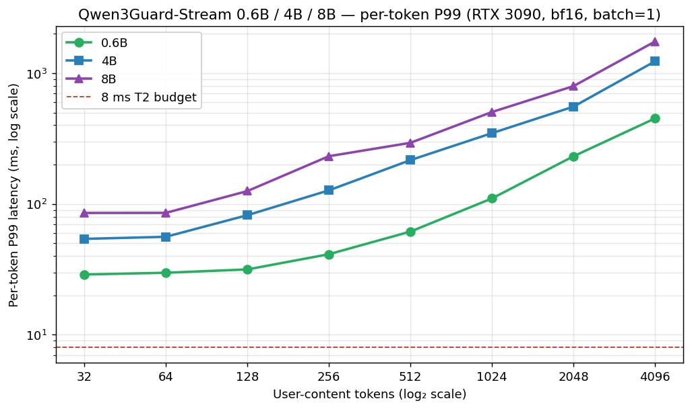
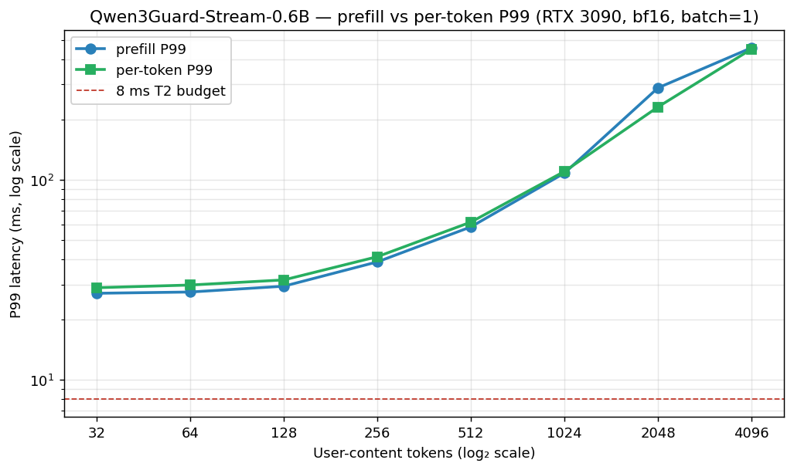

# Qwen3Guard Streaming Classifier Performance Report

[[_TOC_]]

# Introduction

Qwen3Guard-Stream is a variant of Qwen3Guard that classifies each assistant token as it is generated, so the gateway can cut the stream the moment Unsafe content is produced.

This report measures its per-token latency at three sizes on an RTX 3090, frames why token-level tagging is the right tool for the job, and gives a fine-tuning recipe for tenant-specific policy adaptation.

Per-token P99 at 81-token representative input, RTX 3090 bf16: 30.8 ms (0.6B), 56.8 ms (4B), 85.1 ms (8B).
The 8 ms/token T2 budget is broken at every size and every measured input length — the smallest model at the shortest context (0.6B, 32 user tokens) gives 28.9 ms P99, 3.6× over budget.
Per-token cost equals prefill cost within ~10 % across all 27 measured (size × length) cells: the stateful KV API is a correctness mechanism, not a latency amortisation.
The deployable configuration is 0.6B at ≤ 128 user tokens matched to a host LLM running at ≤ 30 tok/s; faster hosts cannot be served by any Qwen3Guard-Stream size without additional mechanisms (concurrent-stream batching, token subsampling, or distillation).

## 1. Background

Our gateway sits between end users and a hosted LLM.
Every assistant response passes through an Output Security Engine that must scan the text and allow / redact / block it within a reasonable time budget.

Qwen3Guard ships two variants that occupy the same taxonomy but different product slots.
**Qwen3Guard-Gen** classifies the complete response once generation finishes.
**Qwen3Guard-Stream** classifies each assistant token as it is emitted.

The product semantics differ accordingly.
Gen is *buffer-and-decide*: the user sees nothing until the classifier has ruled on the whole response.
Stream is *zero-leak*: the user sees tokens as they stream, but generation is cut the instant a token flips the verdict to Unsafe.

Stream is preferable when the deployment cannot tolerate any partial unsafe token reaching the user — public chat, legally-sensitive content.
Gen is preferable when the classifier benefits from seeing the whole response context — enterprise / batch / internal deployments.

The critical latency number differs too.
For Gen, it is whole-response P99 against the response-time budget (200 ms on the A8 T1 contract).
For Stream, it is per-token P99 against the host LLM's token rate — if the classifier is slower than the LLM's own decoding, it becomes the throughput bottleneck on the critical path.
The A8 T2 contract is **per-token P99 < 8 ms**.

## 2. Qwen3Guard-Stream method

### 2.1 Architecture

Stream uses a Qwen3 transformer backbone with two linear classification heads attached after a single LayerNorm on the final hidden state.
One head emits a 3-way distribution over Safe / Controversial / Unsafe; the other emits a 9-way category distribution over the harm taxonomy.
No intermediate MLP, no separate refusal head.
Two full stacks ship per size — one for prompt moderation, one for response moderation — for four heads in total per checkpoint.

Stream is fine-tuned from the Qwen3 **base** model, not from Qwen3Guard-Gen.
The paper states the heads are trained with cross-entropy loss but does not say whether the backbone is frozen or jointly updated, and does not specify the Stream-specific sample count (the 1.19 M figure applies to Gen only).

### 2.2 Token-level labels from response-level data

Response-level labels (Safe / Unsafe for the whole response) have to be converted to per-token labels before the classification head can be supervised.
The paper uses a two-stage boundary-detection pipeline.

For each candidate prefix of a response, the model rolls out *k* continuations and counts how many are judged Unsafe by Qwen3Guard-Gen; if the fraction exceeds 85 %, the prefix is flagged.
A larger Qwen3-235B-A22B judge then verifies the boundary.
The first token meeting both conditions is the **boundary token**; it and every following token inherit the response-level label, while preceding tokens are treated as Safe.

This is stronger than broadcasting the response-level label to every token, and simpler than a CARE-style sliding-window aggregation.
It lets Stream learn a token-level decision boundary, not a paragraph-level one.

### 2.3 Incremental inference

At inference Stream runs incrementally via a custom `stream_moderate_from_ids(token_ids, role, stream_state)` API.
The first call consumes the full user prompt and builds an initial KV cache (the *prefill* call).
Each subsequent call takes one assistant token id and advances the cached state by a single position (the *per-token* call), then reads the two heads at the new last position.
No autoregressive decode loop is involved.

This is the streaming analogue of Gen's forced-prefix single-forward optimisation: in both variants, the decode loop is not on the critical path — Gen removes it via teacher forcing, Stream avoids it by never needing a generative output.

## 3. Latency

All measurements on NVIDIA RTX 3090 (24 GB GDDR6X), CUDA, bfloat16, batch size 1, 3 warmup + 50 timed prefill iterations + 2000 timed per-token iterations per cell.
Representative inputs drawn from `Qwen/Qwen3GuardTest` assistant-turn text; sampled median tokenised length is 81 user tokens.
Length-sweep prompts are synthesised from a fixed seed paragraph tokenised to the target user-content length, then wrapped in the Qwen3 chat template (~ 8 template tokens for the stream variant).

### 3.1 Per-token latency at representative length

| Size | Prefill P50 / P99 ms | Per-token P50 / P99 ms | T2 (< 8 ms)? |
|---|---:|---:|---|
| 0.6B | 25.0 / 27.1 | 26.9 / **30.8** | ✗ (3.9× over) |
| 4B   | 44.7 / 52.0 | 46.8 / **56.8** | ✗ (7.1× over) |
| 8B   | 77.7 / 85.2 | 76.2 / **85.1** | ✗ (10.6× over) |

**Figure 1.** Per-token P99 across the three Qwen3Guard-Stream sizes and the eight-point length sweep. The 8 ms T2 budget (dashed line) sits below every measured cell: 0.6B at 32 user tokens is already 3.6× over; 8B at 4096 user tokens is 218× over. At representative length (81 user tokens) the three sizes separate by ~2×: 30.8 ms / 56.8 ms / 85.1 ms.

### 3.2 Length sweep — Qwen3Guard-Stream-0.6B

| user tok | total tok | Prefill P50 / P99 ms | Per-token P50 / P99 ms |
|---:|---:|---:|---:|
|   32 |   40 |  23.3 /  27.1 |  25.0 /  28.9 |
|   64 |   71 |  24.3 /  27.5 |  26.2 /  29.8 |
|  128 |  134 |  26.6 /  29.4 |  27.5 /  31.6 |
|  256 |  259 |  33.8 /  38.9 |  34.4 /  41.3 |
|  512 |  509 |  49.9 /  58.2 |  51.8 /  61.5 |
| 1024 | 1010 | 102.3 / 108.1 | 104.7 / 110.2 |
| 2048 | 2011 | 218.0 / 288.3 | 219.9 / 231.4 |
| 4096 | 4013 | 374.1 / 457.3 | 377.4 / 450.5 |

**Figure 2.** Prefill P99 and per-token P99 for Qwen3Guard-Stream-0.6B across the length sweep. The two curves overlap: per-token P99 sits within ~10 % of prefill P99 at every length. Both scale roughly linearly with context past 256 user tokens; at the short end (≤128 user tokens) both are near-flat in the 25–30 ms band where weight-read memory traffic dominates.

### 3.3 Per-token cost equals prefill cost

Per-token P50 / prefill P50 ratio across the full 27-cell sweep (3 sizes × 9 lengths):

| len (user tok) | 0.6B | 4B | 8B |
|---:|---:|---:|---:|
|   32 | 1.08 | 1.11 | 0.89 |
|   64 | 1.08 | 1.04 | 0.95 |
|   81 (rep) | 1.08 | 1.05 | 0.98 |
|  128 | 1.03 | 1.00 | 0.97 |
|  256 | 1.02 | 1.04 | 1.10 |
|  512 | 1.04 | 1.24 | 1.06 |
| 1024 | 1.02 | 1.13 | 1.05 |
| 2048 | 1.01 | 1.01 | 1.01 |
| 4096 | 1.01 | 1.00 | 1.02 |

25 of 27 cells sit within ±10 % of unity.
A single-token forward at position n reads the full weight set and runs attention over all n accumulated KV entries, so its cost scales the same way a prefill of n tokens does.
Both operations are memory-bandwidth-bound on this hardware at every measured length — weight reads dominate at short context, KV reads join in at long context — and the per-token call never amortises into anything cheaper than a prefill.
The stateful KV is a correctness mechanism: it lets the classifier score the current position given all prior context.
It is not a latency amortisation.

The consequence for deployment is that per-token ms is the right axis to read, but it is not qualitatively different from prefill ms — doubling context roughly doubles per-token cost, at every size.

### 3.4 How to read these tables — deployment fit

Per-token P99 must stay below the host LLM's own decode latency, otherwise the classifier becomes the rate-limiting step on the critical path.
The A8 T2 contract sets this bound at 8 ms, calibrated against a ~ 125 tok/s host (bf16 vLLM, a realistic 3090 number for a 7-8 B model).

Against slower hosts the fit changes:

| Host rate | Host ms/tok | 0.6B fits at rep len? | 4B? | 8B? |
|---|---:|---|---|---|
|  30 tok/s |  33 | ✓ (P99 30.8 ms) | ✗ | ✗ |
|  60 tok/s |  17 | ✗ | ✗ | ✗ |
| 125 tok/s (T2 as-spec) | 8 | ✗ | ✗ | ✗ |

Only the slowest-host column has a fit — 0.6B at representative length matched to a 30 tok/s host.
A 30 tok/s host is realistic for a 7-8 B model served with modest concurrency on a single 3090, or for CPU-inference / remote-API hosts where per-token latency is dominated by network round-trips.
For anything faster, Qwen3Guard-Stream on 3090 bf16 requires one of the remediation levers listed in §5.3.

## 4. Token-level tagging is an emerging pattern

The LLM-as-classifier pattern at the paragraph level is everywhere by now: Llama Guard, ShieldGemma, WildGuard, Qwen3Guard-Gen are all generative classifiers that ingest a complete turn and emit one verdict.
The token-level analogue is not.

Of the OSS safety guards released through early 2026, only Qwen3Guard-Stream ships a pretrained-causal-LLM backbone with a per-token classification head firing during generation.
Llama Guard (versions 1 through 3), ShieldGemma, WildGuard, and NVIDIA Aegis are buffer-and-classify architectures — they re-use the LLM's generative interface and emit a verdict after a full prefill.
NeMo Guardrails has a streaming mode, but it chunks the output into windows and re-calls an external generative classifier per chunk; there is no per-token head.
The CARE framework is an orchestration layer that consumes a streaming safety signal; it is not itself a classifier architecture.
The closest academic peer is a 2025 streaming content monitor that uses dual response-level and token-level supervision (arXiv:2506.09996) — same direction, no equivalent OSS release.

The broader pattern — pretrained causal LLM backbone plus a lightweight token-classification head for tasks like PII tagging, topic labelling, or domain NER — is nascent in the 2024-2026 literature.
The appeal mirrors Gen's: the backbone carries 119-language coverage and a harm-semantic prior that a from-scratch BERT-NER tagger cannot recover from the available per-token supervision, which is always orders of magnitude smaller than the paragraph-level labels the backbone was trained on.
A from-scratch small-BERT token classifier can be trained on 500-5000 tenant samples, but it cannot recover Qwen3Guard's nine-category multilingual taxonomy without orders of magnitude more labelled data.

Qwen3Guard-Stream is the first production-grade OSS release of this pattern for safety.

## 5. Fine-tuning for tenant-specific policy

This section is advisory — fine-tuning is not in flight in our deployment.
It is here because the argument in §4 implies the same tenant-specific adaptation Gen can receive is available for Stream, and the recipe deserves to be written down before it is needed.

The safest recipe, drawn from 2024-2026 PEFT literature on token-classification heads over causal LLMs:

1. **Freeze the Qwen3 backbone.** Train a LoRA adapter on `q_proj` and `v_proj` at rank 16. Train a freshly initialised token-classification head jointly with the adapter. This is the HuggingFace PEFT reference recipe for token classification and the dominant pattern in recent LLM-backbone NER work.
2. **Adapter learning rate ~2e-4, head learning rate ~1e-3**, cosine decay with 5 % warmup. The head is randomly initialised, so its LR runs 5-10× the adapter LR; the adapter LR is conservative relative to LoRA's usual 1e-4 – 5e-4 band.
3. **Label budget.** 500 – 2000 tenant responses (roughly 20 k – 100 k labelled tokens after the rollout-style boundary pipeline from §2.2) for usable F1; 5 k+ for production-grade per-category F1. Below ~500 labelled samples, a well-crafted prompt on Gen outperforms a fine-tuned Stream.
4. **Replay.** Mix tenant data 1:1 with a slice of the original Qwen3Guard training distribution to blunt catastrophic forgetting of the pretrained prior.
5. **Never full fine-tune.** The pretrained safety prior is the entire value of the Qwen3Guard checkpoint; clobbering it is the dominant failure mode.

Three caveats carry over from the literature:

- *Catastrophic forgetting.* LoRA forgets less than a full fine-tune, but still regresses, and worsens with high rank, high LR, and larger fine-tune data.
- *Multilingual regression.* Small-data fine-tunes on unseen language pairs regress measurably; severe above 10 M samples.
- *Per-category overfitting.* Small per-category datasets overfit; replay and adapter routing (I-LoRA, TreeLoRA) are the standard mitigations.

One open gap: the Qwen3Guard paper does not say whether the original Stream fine-tune itself was full-parameter or adapter-based, nor the sample count. Anyone attempting to reproduce the *training* path should flag this; the *inference* and *adaptation* advisories above are independent of that gap.

### 5.3 Remediation levers for the latency gap

The §3 numbers leave a roughly 4× gap at 0.6B short-context and a 10× gap at 8B short-context relative to the 8 ms T2 budget.
Three levers shrink the gap; none has been measured here, and each trades off against a different product property.

1. **Concurrent-stream batching.** The per-token forward is memory-bandwidth-bound on weight reads at 0.6B (≈ 1.2 GB bf16 per forward on a 936 GB/s card). Multiple concurrent streams can share a single batched per-token forward, amortising the weight read across sessions. The expected speed-up on 0.6B at short context is close to the batch size, until compute or KV bandwidth binds. Cost: the gateway has to multiplex in-flight streams through a shared classifier worker.
2. **Token subsampling.** Classify every Kth emitted assistant token instead of every token. The effective per-token budget is K × 8 ms. K = 4 brings 0.6B at representative length under budget on paper. Cost: the zero-leak guarantee degrades to K-token-leak, since an unsafe token may emit before the next classification fires.
3. **Distillation to a smaller backbone.** A sub-0.6B Qwen3-family backbone with the same two-head top would halve weight-bandwidth and halve the per-token floor. Cost: the checkpoint does not exist as OSS; reproducing the §2.2 boundary-label pipeline plus the multilingual coverage is a nontrivial training project.

## 6. Conclusion

1. Per-token P99 on RTX 3090 bf16 at 81-token representative input: **0.6B — 30.8 ms, 4B — 56.8 ms, 8B — 85.1 ms**.
2. The A8 T2 per-token < 8 ms P99 budget is broken at every size and every measured input length. The smallest model at the shortest context (0.6B, 32 user tokens) gives 28.9 ms P99 — 3.6× over budget.
3. Per-token cost equals prefill cost within ~10 % across all 27 measured (size × length) cells. The stateful KV API is a correctness mechanism, not a latency amortisation; doubling context roughly doubles per-token cost at every size.
4. The deployable configuration is 0.6B at ≤ 128 user tokens matched to a host LLM running at ≤ 30 tok/s. Faster hosts (60 tok/s or above) cannot be served by any Qwen3Guard-Stream size on 3090 bf16 without the remediation levers in §5.3.
5. Three remediation levers remain to be measured: concurrent-stream batching (amortises weight-memory reads across sessions), token subsampling (classify every Kth token, trades zero-leak for K-token-leak), and distillation to a sub-0.6B backbone (not available as OSS).
6. Token-level tagging with a pretrained causal LLM backbone is an emerging pattern. Qwen3Guard-Stream is the first production OSS safety example; buffer-and-classify peers (Llama Guard, ShieldGemma, WildGuard, Aegis, NeMo Guardrails) do not offer a per-token head.
7. Tenant-specific adaptation should use LoRA rank 16 on `q_proj`/`v_proj` with a jointly-trained token-classification head, adapter LR ~2e-4 and head LR ~1e-3, starting at 500 – 2000 labelled samples with 1:1 replay of the original safety distribution. Never full fine-tune.
8. Relative to a from-scratch BERT-NER tagger, the pretrained Qwen3 backbone is the generalisation vehicle — multilingual coverage and harm-semantic prior travel with the weights; they do not travel with a few thousand tenant samples.

## References

[Q3G] Zhao et al. *Qwen3Guard Technical Report.* arXiv:2510.14276, 2025. Model cards at <https://huggingface.co/Qwen/Qwen3Guard-Stream-0.6B> (and 4B / 8B siblings). Apache 2.0.

[PEFT] HuggingFace PEFT documentation — Token Classification with LoRA. <https://huggingface.co/docs/peft/main/en/task_guides/token-classification-lora>.

[LoRA] Hu et al. *LoRA: Low-Rank Adaptation of Large Language Models.* arXiv:2106.09685, 2021.

[LoRA-forgets] Biderman et al. *LoRA Learns Less and Forgets Less.* arXiv:2405.09673, 2024.

[NeMo-stream] NVIDIA Developer Blog. *Stream Smarter and Safer with NeMo Guardrails.* <https://developer.nvidia.com/blog/stream-smarter-and-safer-learn-how-nvidia-nemo-guardrails-enhance-llm-output-streaming/>.

[StreamMon] *From Judgment to Interference — streaming content monitor with dual supervision.* arXiv:2506.09996, 2025.

[LG3] Meta Llama Team. *Llama-Guard-3-8B model card.* <https://huggingface.co/meta-llama/Llama-Guard-3-8B>.

[SG] Zeng et al. *ShieldGemma.* Google, 2024. <https://huggingface.co/google/shieldgemma-2b>.

[3090] NVIDIA. *GeForce RTX 3090 product specifications.* <https://www.nvidia.com/en-us/geforce/graphics-cards/30-series/rtx-3090-3090ti/>.

## Appendix

### Hardware and measurement setup

All experiments on an NVIDIA RTX 3090 (24 GB GDDR6X), CUDA, bfloat16, batch=1, 3 warmup + 50 timed prefill iterations per cell and 2000 timed per-token iterations per cell (each prefill seed advanced one token at a time through the streaming API).
Representative inputs drawn from `Qwen/Qwen3GuardTest` response-moderation field; sampled median tokenised length is 81 user tokens plus an 8-token chat-template overhead.
Length-sweep prompts are synthesised from a fixed seed paragraph tokenised to the target user-content length, then wrapped in the Qwen3 chat template; reported `user` / `total` token counts reflect the actual tokenised lengths.

### Qwen3Guard-Stream-0.6B — full sweep

Prefill (ms): P50 / P95 / P99 / mean / stdev.

| user tok | total tok | P50 | P95 | P99 | mean | stdev |
|---:|---:|---:|---:|---:|---:|---:|
| representative 81 | ~102 |  25.0 |  26.7 |  27.1 |  25.1 |  0.9 |
|   32 |   40 |  23.3 |  24.4 |  27.1 |  23.2 |  1.0 |
|   64 |   71 |  24.3 |  26.1 |  27.5 |  24.7 |  0.9 |
|  128 |  134 |  26.6 |  28.9 |  29.4 |  26.7 |  1.0 |
|  256 |  259 |  33.8 |  38.8 |  38.9 |  33.3 |  3.4 |
|  512 |  509 |  49.9 |  58.0 |  58.2 |  49.4 |  6.5 |
| 1024 | 1010 | 102.3 | 107.5 | 108.1 | 102.9 |  3.7 |
| 2048 | 2011 | 218.0 | 225.6 | 288.3 | 218.7 | 11.1 |
| 4096 | 4013 | 374.1 | 386.5 | 457.3 | 376.8 | 14.2 |

Per-token (ms): P50 / P95 / P99 / mean / stdev.

| user tok | total tok | P50 | P95 | P99 | mean | stdev |
|---:|---:|---:|---:|---:|---:|---:|
| representative 81 | ~102 |  26.9 |  29.6 |  30.8 |  26.9 |  1.7 |
|   32 |   40 |  25.0 |  28.1 |  28.9 |  25.2 |  1.6 |
|   64 |   71 |  26.2 |  29.1 |  29.8 |  26.4 |  1.7 |
|  128 |  134 |  27.5 |  30.2 |  31.6 |  27.6 |  1.5 |
|  256 |  259 |  34.4 |  40.5 |  41.3 |  34.8 |  3.3 |
|  512 |  509 |  51.8 |  60.6 |  61.5 |  51.4 |  6.5 |
| 1024 | 1010 | 104.7 | 109.3 | 110.2 | 104.5 |  6.6 |
| 2048 | 2011 | 219.9 | 227.2 | 231.4 | 219.4 |  9.3 |
| 4096 | 4013 | 377.4 | 387.9 | 450.5 | 378.7 | 12.3 |

### Qwen3Guard-Stream-4B — full sweep

Prefill (ms):

| user tok | total tok | P50 | P95 | P99 | mean | stdev |
|---:|---:|---:|---:|---:|---:|---:|
| representative 81 | ~102 |  44.7 |  51.3 |  52.0 |  41.7 |  8.1 |
|   32 |   40 |  34.2 |  39.6 |  41.8 |  34.5 |  3.3 |
|   64 |   71 |  44.2 |  51.9 |  52.1 |  41.1 |  7.9 |
|  128 |  134 |  74.9 |  78.9 |  79.7 |  68.8 | 12.9 |
|  256 |  259 | 114.7 | 123.0 | 123.3 | 114.2 | 10.5 |
|  512 |  509 | 133.1 | 167.8 | 168.4 | 135.8 | 28.4 |
| 1024 | 1010 | 297.8 | 304.1 | 307.6 | 297.7 |  4.2 |
| 2048 | 2011 | 508.0 | 516.4 | 551.2 | 508.1 |  8.5 |
| 4096 | 4013 | 1153.1 | 1165.8 | 1197.2 | 1152.5 | 10.7 |

Per-token (ms):

| user tok | total tok | P50 | P95 | P99 | mean | stdev |
|---:|---:|---:|---:|---:|---:|---:|
| representative 81 | ~102 |  46.8 |  55.6 |  56.8 |  44.0 |  8.4 |
|   32 |   40 |  37.8 |  51.8 |  54.1 |  38.5 |  7.0 |
|   64 |   71 |  46.2 |  54.5 |  56.1 |  43.4 |  8.1 |
|  128 |  134 |  75.0 |  80.4 |  82.1 |  68.1 | 13.7 |
|  256 |  259 | 119.5 | 125.6 | 127.1 | 116.1 | 13.0 |
|  512 |  509 | 165.5 | 213.5 | 216.4 | 169.9 | 36.5 |
| 1024 | 1010 | 335.5 | 345.1 | 347.8 | 325.1 | 20.4 |
| 2048 | 2011 | 511.6 | 535.9 | 554.5 | 512.8 | 11.9 |
| 4096 | 4013 | 1153.1 | 1169.8 | 1230.8 | 1154.4 | 14.4 |

### Qwen3Guard-Stream-8B — full sweep

Prefill (ms):

| user tok | total tok | P50 | P95 | P99 | mean | stdev |
|---:|---:|---:|---:|---:|---:|---:|
| representative 81 | ~102 |  77.7 |  84.8 |  85.2 |  71.3 | 14.7 |
|   32 |   40 |  63.8 |  68.9 |  69.7 |  54.8 | 14.3 |
|   64 |   71 |  79.2 |  84.3 |  84.4 |  70.8 | 15.7 |
|  128 |  134 | 109.2 | 125.7 | 128.0 |  98.4 | 23.7 |
|  256 |  259 | 187.5 | 206.9 | 207.5 | 166.5 | 39.8 |
|  512 |  509 | 267.8 | 273.6 | 274.7 | 267.5 |  4.5 |
| 1024 | 1010 | 431.0 | 439.2 | 467.9 | 428.6 | 17.9 |
| 2048 | 2011 | 742.9 | 751.3 | 793.7 | 743.4 |  9.0 |
| 4096 | 4013 | 1645.7 | 1689.8 | 1696.9 | 1655.5 | 17.8 |

Per-token (ms):

| user tok | total tok | P50 | P95 | P99 | mean | stdev |
|---:|---:|---:|---:|---:|---:|---:|
| representative 81 | ~102 |  76.2 |  83.6 |  85.1 |  67.8 | 15.2 |
|   32 |   40 |  56.8 |  81.7 |  85.4 |  57.6 | 16.0 |
|   64 |   71 |  75.2 |  83.6 |  85.5 |  66.6 | 15.4 |
|  128 |  134 | 106.1 | 122.7 | 125.5 |  93.6 | 22.3 |
|  256 |  259 | 205.9 | 230.0 | 231.9 | 184.4 | 43.1 |
|  512 |  509 | 284.2 | 291.0 | 293.4 | 283.2 |  5.9 |
| 1024 | 1010 | 454.8 | 465.4 | 504.6 | 449.7 | 17.1 |
| 2048 | 2011 | 747.9 | 774.3 | 795.8 | 750.0 | 12.1 |
| 4096 | 4013 | 1674.7 | 1715.2 | 1743.4 | 1679.8 | 23.3 |

### Open questions about the Stream training pipeline

The Qwen3Guard paper describes the classification head architecture, the boundary-token labelling pipeline, and the backbone identity, but is silent on three points that would matter for a reproduction attempt:

- Whether the transformer backbone is frozen during Stream training, or jointly updated with the heads.
- The Stream-specific sample count (the 1.19 M figure applies to Gen only).
- Whether the Stream fine-tune is full-parameter or adapter-based.

Anyone reproducing the training path should flag these as unknowns. The inference-side numbers reported in §3 and the adaptation recipe in §5 are independent of the gap.
